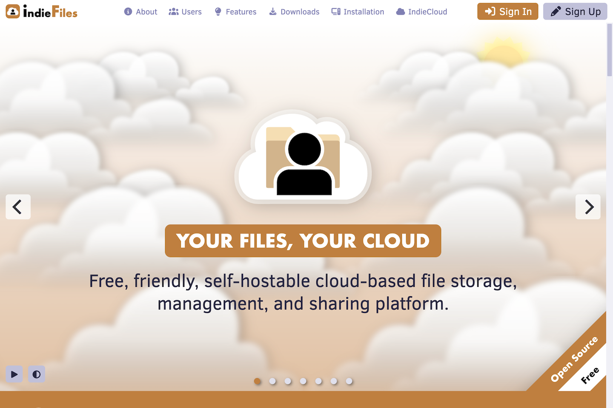
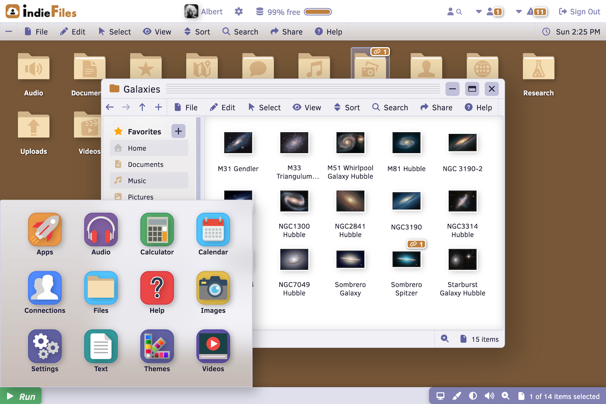

	

# Sharedigm

Sharedigm is a web platform that allows uploading, managing, and sharing of data.  It combines file sharing and management with a social network and a variety of apps.  It provides an extensive set of tools for viewing, editing, and sharing data in an intuitive desktop-like user interface experience.

Welcome Screen

Desktop

## Features

The Sharedigm OS can be used as a cloud operating system to manage and share your files or to build cloud based platforms for a wide variety of purposes. 

- Hostable it yourself!
- Enjoy the easy and intuitive user interface.
- View photos and videos.
- Listen to audio and podcasts.
- Run a variety of apps.
- Engage in public discussions or private chats.

## Benefits

By installing the appropriate apps, you can use the Sharedigm platform for a wide variety of purposes:

- Regain control over your own data.
- Share your files, images, music, and ideas.
- Keep in touch with friends, family and colleagues.
- Communicate in a secure and private way.
- Create your own personalized and customized platform.

## Live Demo

You can create an account and explore the features and benefits of the platform at [www.sharedigm.com](https://www.sharedigm.com).

## Sharedigm Architecture

The sharedigm system consists of two main components: (1) The Sharedigm operating system and (2) The Sharedigm apps.

### 1. Sharedigm OS

The Sharedigm operating system can be used to run Sharedigm apps but also can be used as a platform for your own app development.
[https://github.com/Sharedigm/SharedigmOS](https://github.com/Sharedigm/SharedigmOS)

### 2. Sharedigm Apps

The Sharedigm app store is a repository of apps that can be installed on the Sharedigm OS.  It includes an installer and uninstaller to make it easy to install apps and tailor the platform to your specific purposes.
[https://github.com/Sharedigm/SharedigmAppStore](https://github.com/Sharedigm/SharedigmAppStore)

## Who is Sharedigm For?

### 1. For Users

If you are a software user with some web hosting skills, then you can use Sharedigm to deploy your own platform to manage your own data.

- Manage your files, photos, music, code, your digital life. 
- Communicate with friends family and colleagues with discussion topics and private messages
- Play music, view photos, and watch videos
- Customize the look and feel of the platform to match your own personal brand with no coding required.

### 2. For Developers
If you are a developer, then you can use the Sharedigm OS to build new platforms.  Build cloud applications the smart, efficient way, rather than in the broken, disjointed, and archaic way that characterizes modern web development.  The platform can be easily customized with no coding required. Build cloud platforms like you build desktop applications by building on top of a true OS instead of re-inventing the wheel.

- Build your own platform by customizing the set of installed apps, configuration, branding, and theme to match your own needs.
- If you have coding skills, you can create new apps for the platform to suit your specific needs. 

## Documentation

A complete User Guide detailing the use of the platform is available at:
[https://www.sharedigm.com/#help](https://www.sharedigm.com/#help)

## Installation

Please follow the instructions in [https://www.sharedigm.com/#installation](https://www.sharedigm.com/#installation) to install the software on your computer or web server.

## License

Distributed under the <a href="https://en.wikipedia.org/wiki/MIT_License">MIT License</a> which allows unrestricted use of the software. See [LICENSE](LICENSE) for more information.

## Contact

mailto:admin@sharedigm.com
